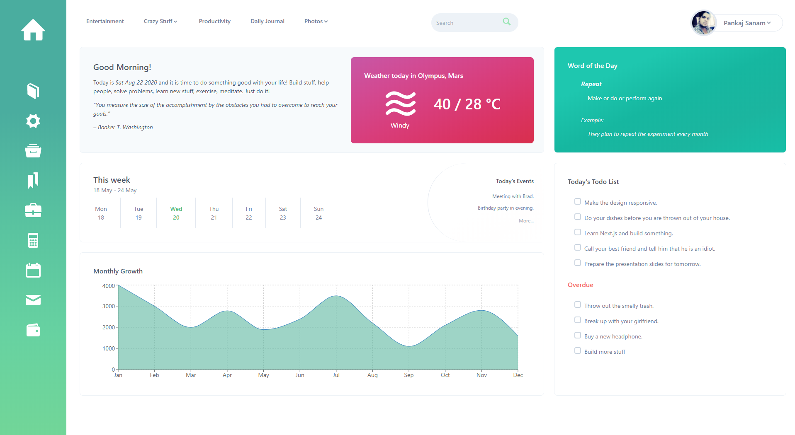

# Mint React 0.6.0


A beautifully crafted boilerplate for starting a React JS and Tailwind css project using Mint Express as backend API.

**Demo:** Coming Soon

<p align="center">
    
</p>

## Features

1. Jest for test cases with coverage report.
2. Tailwind CSS ready.
3. Pre-configured ESLint.
4. Login and Registration
5. Protected routes

## Quick start

Clone the repo:

`git clone https://github.com/creativetimofficial/material-dashboard-react.git`.

Run `npm install` to install all the dependencies.

Run `npm watch:css` and `npm start` to watch the files and start the server.

## Quick start

#### `npm build:css`

Creates a build with updated style.css from index.css.

#### `npm watch:css`

Watch the changes done in the src/index.css and build them in public/style.css

#### `npm start`

Runs the app in the development mode.

Open [http://localhost:3000](http://localhost:3000) to view it in the browser.

#### `npm run build`

Builds the app for production to the `build` folder.

## Directory Structure

```
|-- public
|-- src
    |-- assets
    |-- components
        |-- __tests__
        |-- Dashboard
        |-- Guest
        |-- Layout
        |-- shared
        |-- User
```

## TODO
- [ ] Add a demo
- [ ] Increase code coverage

## License

MIT License
